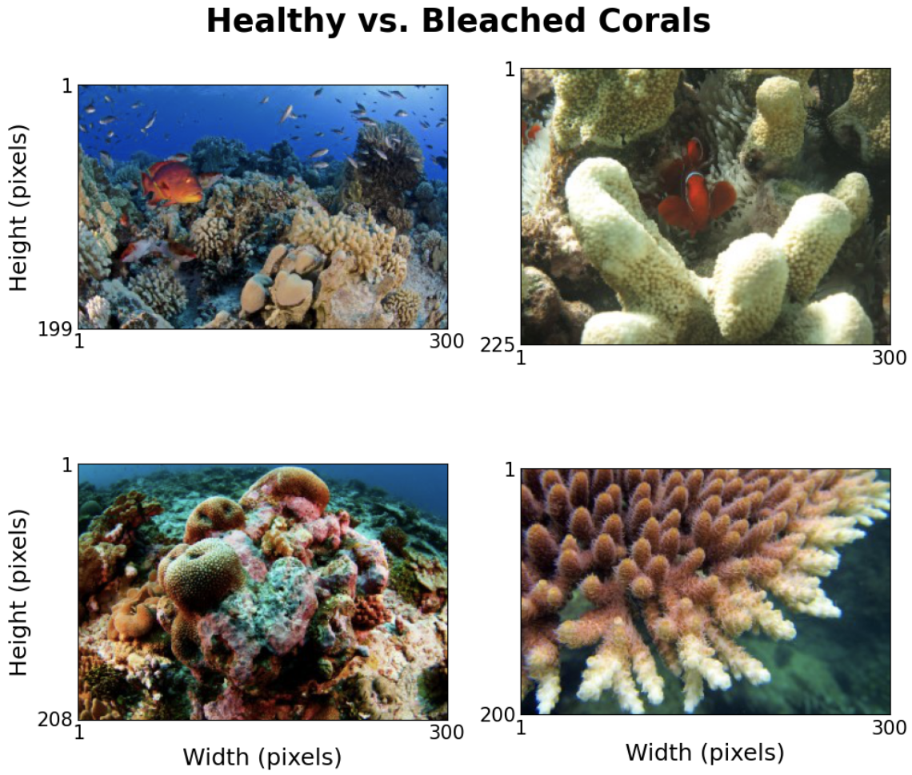
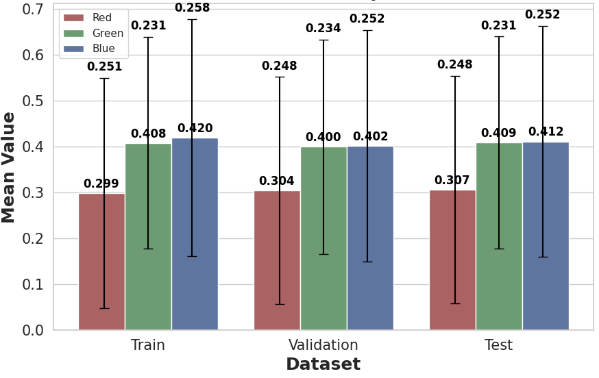
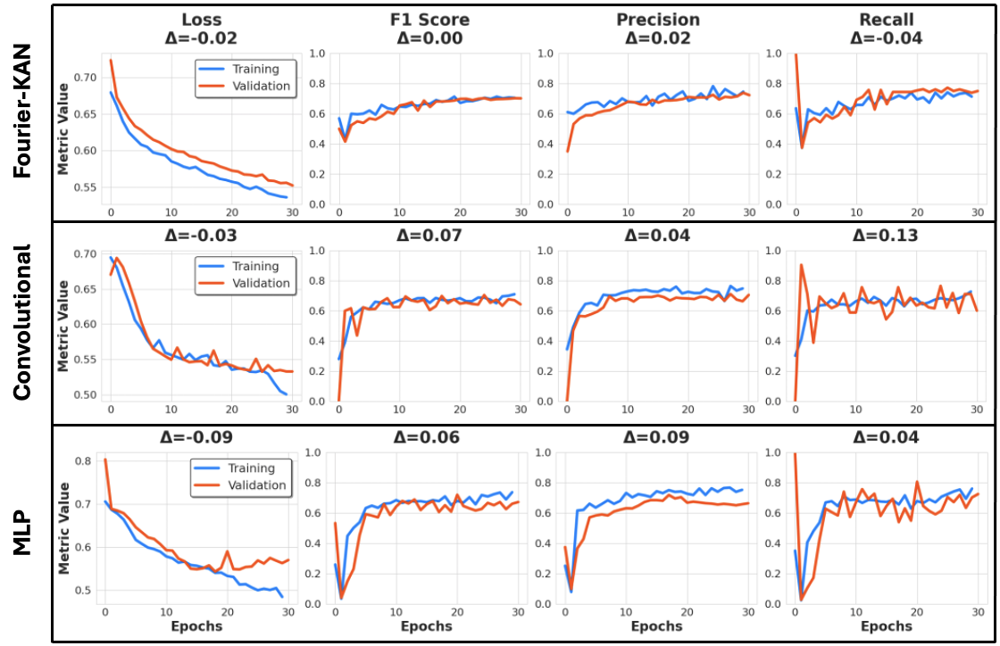
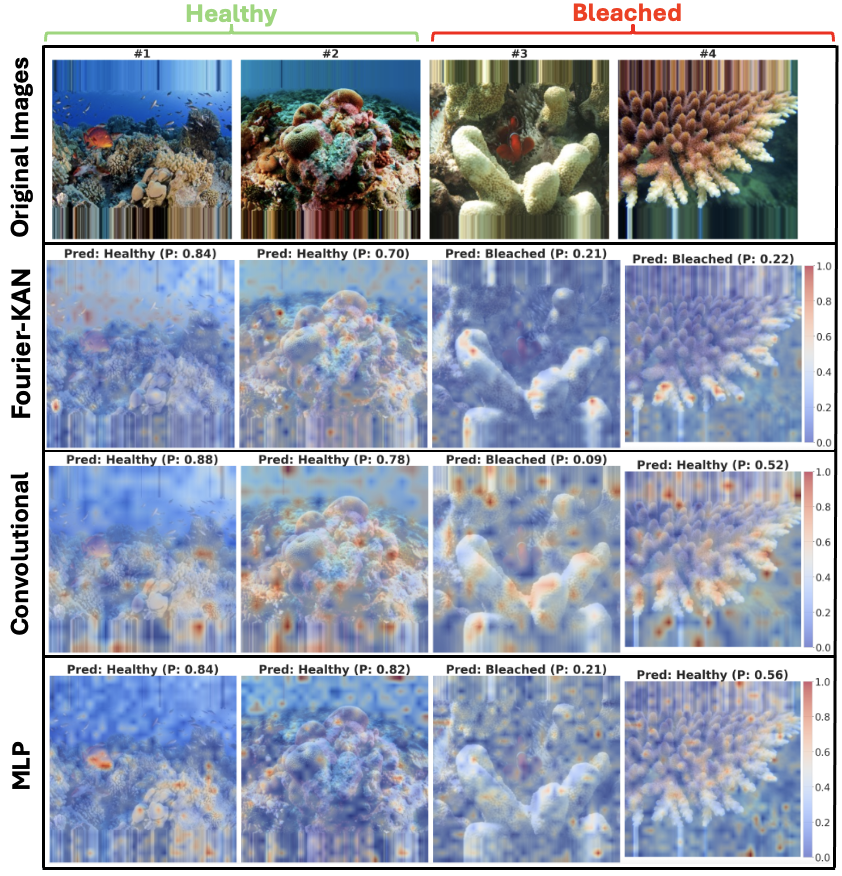
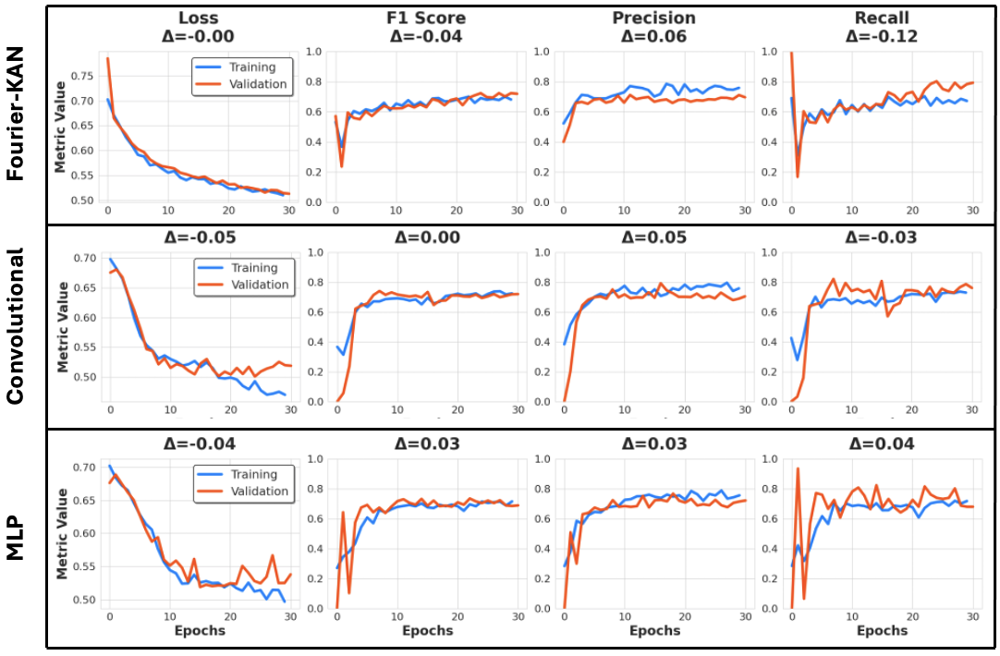
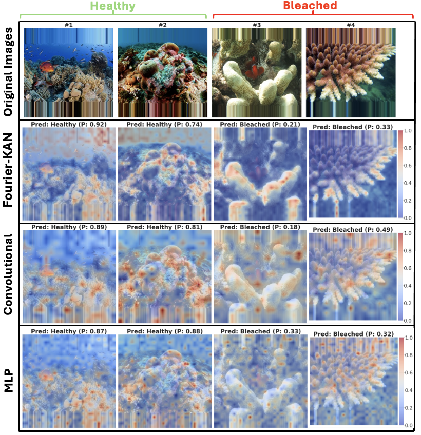

# Coral Health Classification Using Vision Transformers with Kolmogorov-Arnold Fourier Embeddings



## Abstract

Coral reefs are critical marine ecosystems under increasing threat from climate change and environmental degradation. This study introduces a novel application of Vision Transformers (ViTs) for classifying coral health, leveraging **Kolmogorov-Arnold Networks (KAN)** with Fourier embeddings. Our findings reveal that the **KAN-Fourier embeddings** outperform traditional convolutional and MLP-based embeddings in capturing intricate patterns, such as fish presence and early signs of coral bleaching, offering improved interpretability and robustness.

## Key Features
- **Vision Transformers (ViTs):** Employing self-attention mechanisms for local and global feature extraction.
- **Kolmogorov-Arnold Fourier Embeddings:** Leveraging learnable sine and cosine transformations for complex pattern recognition.
- **Data Augmentation Techniques:** Enhancing robustness using lighting adjustments, flips, and resizing.
- **Explainable AI:** Visualizing attention maps for interpretability.

## Contributions
1. Introduced **KAN-Fourier embeddings** in ViTs for coral classification.
2. Compared Fourier-based, convolutional, and MLP embeddings.
3. Evaluated data augmentation impacts on model performance.
4. Demonstrated model explainability through attention maps.

---

## Table of Contents
1. [Introduction](#introduction)
2. [Dataset](#dataset)
3. [Methodology](#methodology)
4. [Experiments & Results](#experiments--results)
5. [Limitations & Future Work](#limitations--future-work)
6. [How to Run](#how-to-run)
7. [References](#references)

---

## Introduction

Coral reefs, vital to marine ecosystems, face challenges such as bleaching caused by climate change. Automating coral health monitoring with deep learning addresses the scalability limitations of traditional manual methods.

Our approach integrates **Kolmogorov-Arnold Fourier embeddings** into Vision Transformers, capturing complex patterns like fish presence and coral bleaching signs.

---

## Dataset

The dataset comprises **923 images** of healthy and bleached corals, sourced from [Kaggle](https://www.kaggle.com). Key preprocessing steps include:
- Removing images with dimensions > 300 pixels.
- Stratified splits (Train: 70%, Validation: 20%, Test: 20%).
- Data augmentation with brightness, contrast, and saturation adjustments.



---

## Methodology

### Vision Transformer Architecture
- **Patch Embedding:** Divides images into patches with Fourier, convolutional, or linear embeddings.
- **Self-Attention Mechanisms:** Captures long-range dependencies.
- **Classification Head:** Outputs binary predictions (healthy or bleached).

### Embedding Strategies
1. **Fourier-based Embedding:** Uses trigonometric functions inspired by Kolmogorov-Arnold Networks.
2. **Convolutional Embedding:** Preserves spatial hierarchies.
3. **MLP Embedding:** Learns flexible non-linear representations.

### Evaluation Metrics
- Accuracy, Precision, Recall, F1-Score (micro-averaged for class imbalance).

---

## Experiments & Results

### Training on Original Data
- **KAN-Fourier Embedding:** Best performance with minimal overfitting.
- **Convolutional Embedding:** Strong precision but less robust to noise.
- **MLP Embedding:** Balanced performance across metrics.

#### Loss & Performance Curves


#### Attention Maps


### Training on Augmented Data
- Augmentation improved robustness but introduced variability in some metrics.
- Fourier embeddings showed resilience, while convolutional embeddings were more sensitive.

#### Loss & Performance Curves


#### Attention Maps


### Comparative Performance
| Model           | Accuracy | F1-Score | Precision | Recall |
|------------------|----------|----------|-----------|--------|
| Fourier (Original) | 0.754    | 0.729    | 0.728     | 0.745  |
| Convolutional (Original) | 0.765 | 0.716 | 0.757 | 0.694 |
| Fourier (Augmented) | 0.724    | 0.693    | 0.738     | 0.677  |

---

## Limitations & Future Work

### Limitations
- **GPU Constraints:** Restricted hyperparameter tuning and model exploration.
- **Limited Dataset Diversity:** Augmented data improved generalization but introduced noise.

### Future Directions
1. Experiment with **SWIN Transformers** for hierarchical attention.
2. Integrate **multi-modal data** (e.g., environmental metadata).
3. Enhance interpretability with advanced explainable AI techniques.

---

## How to Run

### Prerequisites
- Python 3.8+
- PyTorch
- Matplotlib, NumPy, Pandas

### Steps
1. Clone the repository:
   ```bash
   git clone git@github.com:your-username/coral-classification.git
   cd coral-classification
